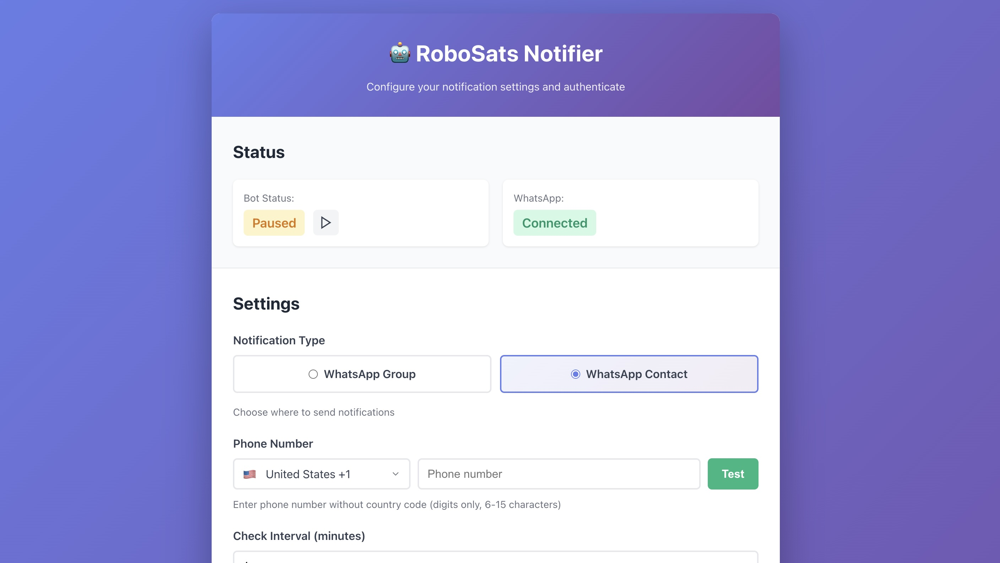

# RoboSats Notifier

[](https://hub.docker.com/r/orangepanther21/robosats-notifier)
[](https://opensource.org/licenses/MIT)

Get instant notifications when new offers appear on [RoboSats](https://robosats.com) P2P exchange.

> ⚠️ **Disclaimer:** This is an unofficial community project, not affiliated with RoboSats.



## Features

- 🔔 **Real-time notifications** — Get instant alerts for new offers (WhatsApp supported)
- 🌐 **Multi-coordinator** — Monitor all RoboSats federation coordinators
- 💱 **Currency filters** — Track only the currencies you care about
- 🖥️ **Web UI** — Easy configuration and QR code authentication
- 🐳 **Docker & Umbrel** — One-click deployment on Umbrel nodes

## Quick Start

### Umbrel (Recommended)

1. Install **RoboSats** app on your Umbrel
2. Add the community app store
3. Install **RoboSats Notifier**
4. Open the web UI and scan QR code
5. Configure your bot and you're done!

### Docker

```bash
docker run -d -p 12597:12597 \
  -v $(pwd)/data:/data \
  -v $(pwd)/.wwebjs_auth:/app/.wwebjs_auth \
  orangepanther21/robosats-notifier:latest
```

Open `http://localhost:12597` to configure.

## Configuration

All settings are available through the web UI at port 12597:

| Setting | Description |
|---------|-------------|
| **Notification Settings** | Configure where to receive notifications (WhatsApp group/contact) |
| **Currencies** | Which currencies to monitor (USD, EUR, etc.) |
| **Coordinators** | Which RoboSats coordinators to check |
| **Check Interval** | How often to check for new offers (minutes) |

### Supported Currencies

USD, EUR, GBP, AUD, CAD, JPY, CNY, CHF, SEK, NZD, KRW, TRY, RUB, ZAR, BRL, CLP, CZK, DKK, HKD, HUF, INR, ISK, MXN, MYR, NOK, PHP, PLN, RON, SGD, THB, TWD, ARS, VES, COP, PYG, PEN, UYU, BOB, CRC, GTQ, HNL, NIO, PAB, DOP

## Notification Format

Each offer is sent as a separate message:

```
*🟢 BUY Offer (LibreBazaar)*
━━━━━━━━━━━━━━━━━
💰 *Amount:* 200,000 USD (~39,216 sats)
💵 *Price:* 59,134 USD (+2.5%)
🏦 *Payment:* Bank Transfer
⏳ *Expires in:* 2h 30m
🔗 [link to offer]
```

## Requirements

- **RoboSats** app installed (provides the API)
- **Messaging account** for notifications (WhatsApp currently supported)
- **Umbrel** node or any Docker-capable system

## Development

### Local Setup

```bash
# Clone the repository
git clone https://github.com/OrangePanther21/robosats-notifier.git
cd robosats-notifier

# Install dependencies
npm install

# Create .env file
cp .env.example .env
# Edit .env with your settings

# Run in development mode
npm run dev
```

### Configuration Methods

**Recommended:** Use the web UI at `http://localhost:12597` for easy configuration.

**Advanced:** For Docker deployments or headless setups, you can use environment variables:

```env
WEB_PORT=12597
WHATSAPP_GROUP_NAME=Your Group Name
ROBOSATS_API_URL=http://localhost:12596
ROBOSATS_ONION_URL=http://robosatsy56bwqn56qyadmcxkx767hnabg4mihxlmgyt6if5gnuxvzad.onion
ROBOSATS_COORDINATORS=all
TARGET_CURRENCIES=USD,EUR
CHECK_INTERVAL_MINUTES=5
LANGUAGE=EN
```

> **Note:** The app supports both methods. Settings from the web UI are saved to `config.json` and take precedence over environment variables.

### Project Structure

```
src/
├── index.js           # Main entry point
├── config.js          # Configuration management
├── robosatsClient.js  # RoboSats API integration
├── whatsappClient.js  # WhatsApp client
├── messageFormatter.js # Message formatting
└── web/               # Web UI (Express server)
```

### Testing

```bash
# Test with mock data (no API needed)
ROBOSATS_USE_MOCK=true npm test

# Run the bot
npm start
```

## Contributing

Contributions are welcome! Here's how you can help:

### Ways to Contribute

- 🐛 **Report bugs** — Open an issue describing the problem
- 💡 **Suggest features** — Share your ideas in issues
- 🔧 **Submit PRs** — Fix bugs or implement features
- 📖 **Improve docs** — Help make documentation clearer
- 🌍 **Add translations** — Help translate to other languages

### Pull Request Process

1. Fork the repository
2. Create a feature branch (`git checkout -b feature/amazing-feature`)
3. Make your changes
4. Commit with clear messages (`git commit -m 'Add amazing feature'`)
5. Push to your branch (`git push origin feature/amazing-feature`)
6. Open a Pull Request

### Code Style

- Use meaningful variable and function names
- Add comments for complex logic
- Follow existing patterns in the codebase
- Keep functions small and focused

### Feature Ideas

- [ ] Price alerts (notify only within price range)
- [ ] Payment method filters
- [ ] Multiple WhatsApp groups support
- [ ] Web dashboard with statistics

## Troubleshooting

### QR Code Won't Scan

- Delete `.wwebjs_auth/` folder and restart
- Check if messaging service is blocked by firewall

### "Group not found" Error

- Group name must match exactly (case-sensitive)
- Ensure your account is in the group

### No Notifications

- Check if RoboSats app is running
- Verify currencies are configured correctly
- Check logs: `docker logs <container>`

## Resources

- [RoboSats Learn](https://learn.robosats.org) — Official documentation
- [RoboSats API](https://learn.robosats.org/docs/api/) — API reference
- [Umbrel](https://umbrel.com) — Home server OS

## License

MIT License — see [LICENSE](LICENSE) for details.

## Acknowledgments

- [RoboSats](https://robosats.com) — P2P Bitcoin exchange
- [whatsapp-web.js](https://github.com/pedroslopez/whatsapp-web.js) — WhatsApp Web API
- [Umbrel](https://umbrel.com) — Home server platform

---

**Made with 🧡 by the Bitcoin community**
